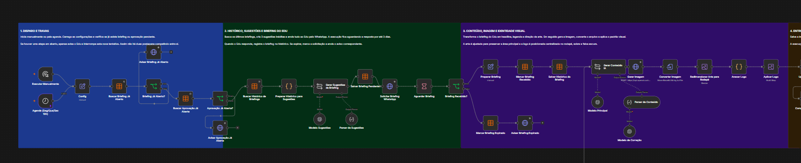

# Organizar Fluxo

Skill para organizar visualmente workflows do n8n sem mudar a lógica da automação.

## Exemplo visual



## O que ela faz

- Reorganiza nós, espaçamento e ramificações no canvas.
- Substitui stick notes genéricas por notas que explicam cada sessão.
- Mantém as notas alinhadas pelo topo e dimensionadas para cobrir suas áreas.
- Valida as alterações antes e depois de aplicá-las.

Ela não altera conexões, credenciais, prompts, regras de negócio, execução ou ativação do workflow.

## Quando usar

Peça ao Codex para **organizar o fluxo**, **ajustar a estrutura visual**, **melhorar o espaçamento**, **organizar o canvas** ou **revisar as stick notes** de um workflow n8n.

## Instalação

Clone este repositório e deixe a pasta `organizar-fluxo` dentro do diretório de skills do Codex:

```text
~/.codex/skills/organizar-fluxo/
```

Depois reinicie ou abra uma nova sessão do Codex. A skill é detectada automaticamente quando a solicitação envolve organização visual de workflows n8n.

## Estrutura

```text
organizar-fluxo/
├── SKILL.md
└── agents/
    └── openai.yaml
```

## Escopo

Esta skill cuida somente da apresentação visual. Para mudanças de comportamento, integrações ou regras da automação, faça uma solicitação separada e explícita.
